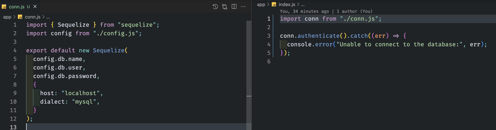

# Demo ORM

## Getting Started

`npm i express`
`npm i mysql2`
`npm i sequelize`
`npm i dotenv`

### Create a .env file

Include: `DB_USER`, `DB_PASSWORD`, `DB_NAME` (e.g. `library_db`)

### Create `app/config.js`

We only allow access to **environment variables** in this file. It has 1️⃣ job, like most good modules and only focuses on that job.

```js
import dotenv from "dotenv";

dotenv.config();

export default {
  db: {
    name: process.env.DB_NAME,
    user: process.env.DB_USER,
    password: process.env.DB_PASSWORD,
  },
};
```

---

Start looking at [the Sequelize Docs](https://sequelize.org/docs/v6/getting-started/). [Connect to our database](https://sequelize.org/docs/v6/getting-started/) using **Option 3** shown. Do this from `app/index.js`.

---

### Modularize the Connection

Create a file, `app/conn.js`. This is what will be responsible for creating the connection via `config.js` and `sequelize`. It will export this out for use in other files.



### Create a `Book` Model

We will [extend Model](https://sequelize.org/docs/v6/core-concepts/model-basics/#extending-model)
